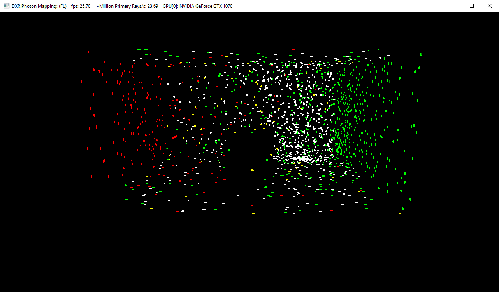
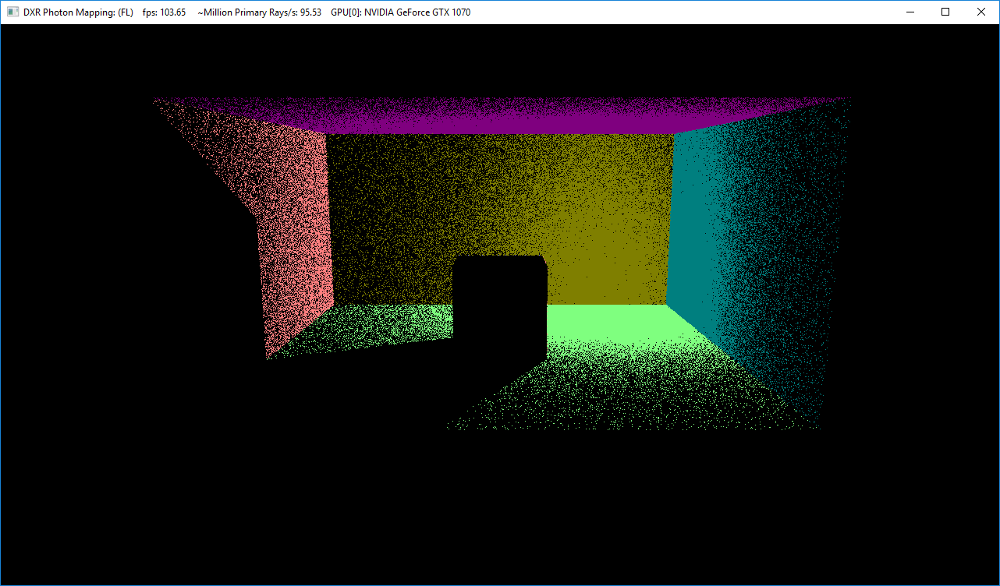

# DXR-PhotonMapper

## Goal
An implementation of Progressive Photon Mapping using DXR

## Milestone 2
Implemented features:
1) Storing photon position, color and normals in textures (g-buffers)
2) Two Pass Render System
3) Basic second pass photon gather

## Results

**Photon Gather (Contains 1000 photons)**

**Photon Color Visualization (Contains 1 Million Photons)**

**Photon Normal Visualization (Contains 1 Million Photons)**

**Photon First Bounce Visualization (Contains 1 Million Photons)**

## Milestone 1

## Current Progress (Milestone 1):
1. Running DXR using Fallback Layer
2. Photon Generation per light
3. Photon Visualization.

## Problems Faced:
1. Running Fallback Layer on Titan V.
2. Finding out the ray intersection miss after ray trace.
3. Writing Photon Data out - options include unordered access view (textures).
4. Parsing through the Photon data - kd-tree or use DXR.

## Acknowledgement
The Titan V used for this project was donated by the NVIDIA Corporation.
We gratefully acknowledge the support of NVIDIA Corporation with the donation of the Titan V GPU used for this project

The base code for this project was inspired from DirectX Ray Tracing samples from Microsoft. The repository can be found here: https://github.com/Microsoft/DirectX-Graphics-Samples

## Build Instructions

1) Ensure you have Windows 10 (atleast build 1803)
2) Enable Developer Mode : Settings > Updates and Security > For Developers > Select Developer mode
3) Visual Studio 2017 version 15.8.7
4) Windows 10 SDK. [Version 10.0.17763.132](https://developer.microsoft.com/en-US/windows/downloads/windows-10-sdk)
5) Open the PhotonMapper\PhotonMapper.sln and perform Build

**Note** DXR is currently being run on 'Fallback Layer'. Some GPUs may not supported this feature.
Currently tested GPU is NVIDIA GTX 1080, running driver version 399.07. I am speculating that any GTX 10x0 should run, but please ensure that its driver is up to date.
