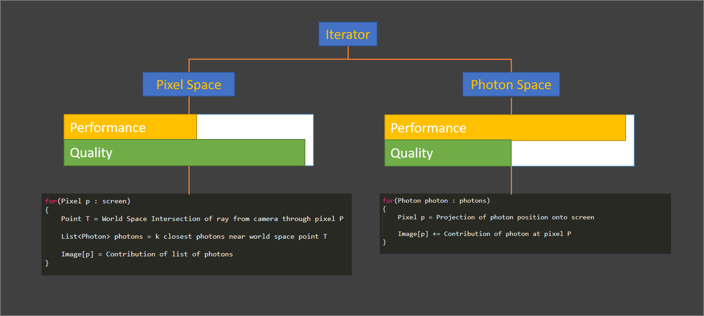
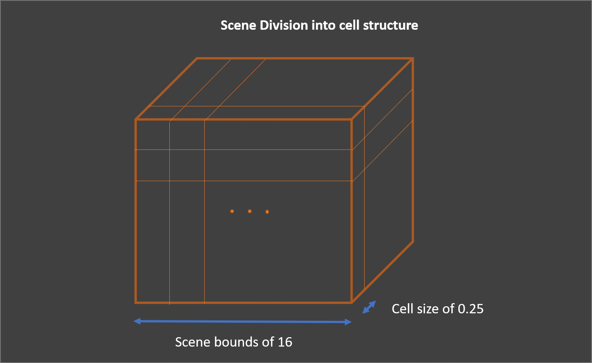
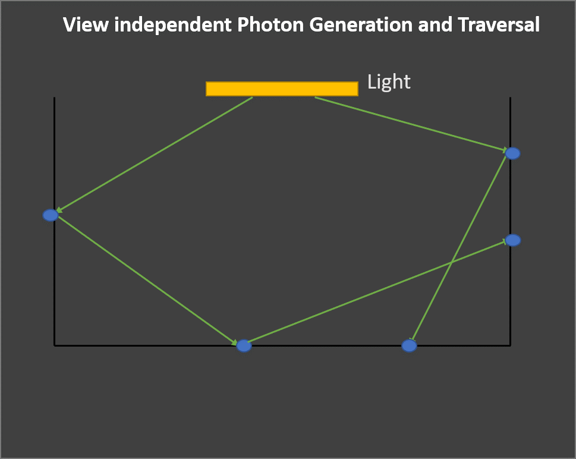
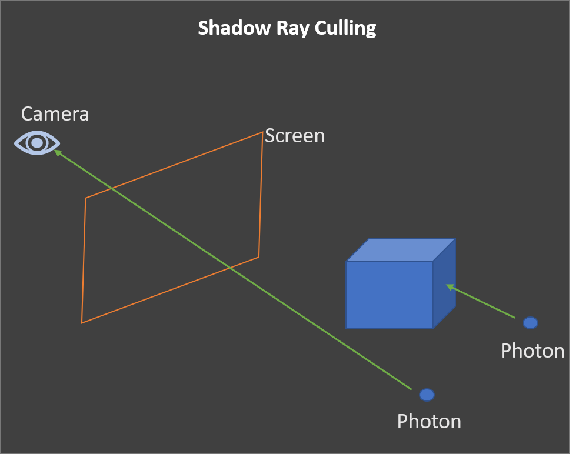
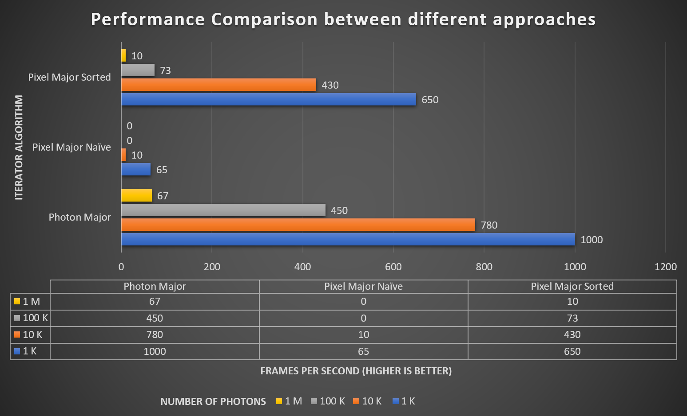

# DXR-PhotonMapper

## Contributors
**Anantha Srinivas**
[LinkedIn](https://www.linkedin.com/in/anantha-srinivas-00198958/), [Twitter](https://twitter.com/an2tha)  
**Connie Chang**
[LinkedIn](https://www.linkedin.com/in/conniechang44), [Demo Reel](https://www.vimeo.com/ConChang/DemoReel)

## Goals of the project
* **Implementation of Photon Mapping using DXR**
* **Possible search time optimizations**
* **Alternate approaches to spatial data structure construction**

## Acknowledgement
**The Titan V used for this project was donated by the NVIDIA Corporation.
We gratefully acknowledge the support of NVIDIA Corporation with the donation of the Titan V GPU used for this project**

**Pixel major rendering of 1 million photons with 8 bounce per photon**  


**Photon major rendering of 1 million photons with 8 bounce per photon**  


## Link to Presentation


---

# Introduction

## Pixel Iterator vs Photon Iterator



---

**Pixel Iterator**
This is the classic implementation of Photon Mapping, where in the photons are stored in a spatial data structure. While rendering, we launch rays from camera through the screen pixel, find the intersection point and k-nearest photons to that intersection point. 

Generally, to optimize the search, the photons are stored in a k-dimensional tree. However, construction and search of that tree can be expensive and hard on the GPU. Lets consider that the k-d tree is flattened and stored in a single array of pixels. Given that the data structure is a tree, the left child and right child of the parent may or may not be next to it in memory. Additionally, at each search call we are accessing global memory to the tune of ```log(N)```, This will result in a huge bottleneck and becomes largly dependent on the global memory access speads.

A simpler solution we found is based on creating a 3D hashgrid [2]. This hashgrid will be designed such that photons that are near to each other will be stored close to each other. We will explore this data structure if time permits.

---

**Photon Iterator**
This is a more optimized approach to rendering the photons. The concept is to trace the photon back to the camera and determine the contribution to the intersecting pixel on screen. This does not involve the need to create and maintain any spatial data structure.

However, the shortfall of the naive approach is that we need to iterate through all the photons in the screen, and determine if they fall inside the view frustrum or not. In the current implementation we perform this check INSIDE the ray generation shader. As a result a lot of threads are wasted. We will try to find a way if we can optimize it and cull the photons which have no contribution to the screen.

Another shortfall of this approach is that it produces a lot of variance in the result. We have a couple of solutions in mind to potentially reduce this. The first way would be to have a rule that each photon may contribute to more that one pixel on screen. This will require us to reverse project a sphere of influence around the photon onto the screen to determine the affecting pixels. We would also need to keep in mind the fraction level of contribution to any pixel. The second solution is perform some level of denoising on the output image. However, that maybe beyond the scope of this short project.

# Implementation

## Pixel Major Iterator

Cell Structure         |  Photon-Cell Sorting
:-------------------------:|:-------------------------:
  |  

## Photon Major Iterator

First pass (once per scene)             |  Every Frame update
:-------------------------:|:-------------------------:
  |  

## Camera Controls
Translate along look vector - W and S  
Translate along right vector - A and D  
Translate along up vector - Q and E  

Rotate about look vector - M and N   
Rotate about right vector - Up and Down arrows  
Rotate about up vector - Left and Right arrows  

**Pixel Major rendering 100,000 photons**


# Performance Analysis

**Note** DXR is currently being run on 'Fallback Layer', since we do not have an actual RTX GPU. Hence, all performance metrics are captured with Fallback Layer.

**Test Conditions**
* GPU - NVIDIA Titan X
* DirectX Fallback Layer
* V-Sync Off

**Photon Mapping Parameters**
* 8 Bounces per photons
* Max Scene size of 16 and cell width of 0.25
* Total number of cells in scene - 2 ^ 18
* Search radius - 0.5



# Build Instructions

1) Ensure you have Windows 10 (atleast build 1803)
2) Enable Developer Mode : Settings > Updates and Security > For Developers > Select Developer mode
3) Visual Studio 2017 version 15.8.7
4) Windows 10 SDK. [Version 10.0.17763.132](https://developer.microsoft.com/en-US/windows/downloads/windows-10-sdk)
5) Open the PhotonMapper\PhotonMapper.sln and perform Build

**Note** DXR is currently being run on 'Fallback Layer'. Some GPUs may not supported this feature.
Currently tested GPU is NVIDIA GTX 1080, running driver version 399.07. I am speculating that any GTX 10x0 should run, but please ensure that its driver is up to date.
